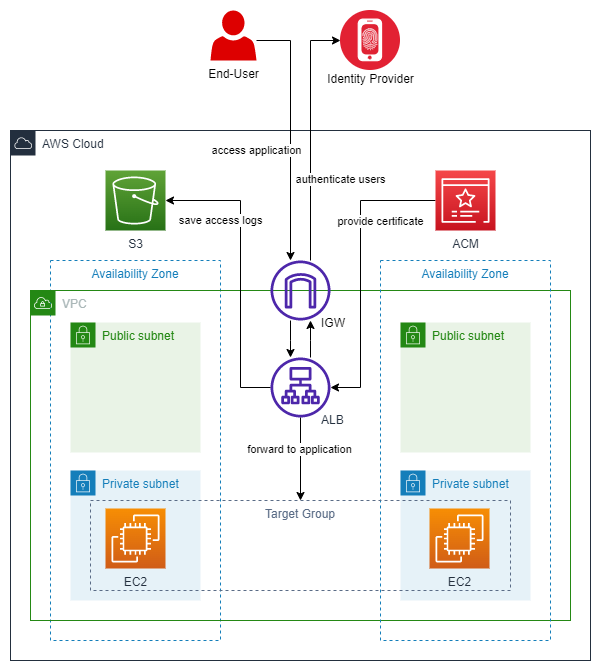

# aws-alb-oidc-integration

> This project is part two of my software architecture journey. See my [software-architecture-journey](https://github.com/mykingdomforapawn/software-architecture-journey) repository for more details.

This simple AWS solution setup enables the OIDC integration of an Application Load Balancer with an Identity Provider of your choice. lets the user write down commands to test the application logic in a script-like manner. The user can play around with a combination of different assets in a portfolio account.

---

## Table of contents:
<!--- [Why? - How? - What?](#why---how---what)
-->
- [Get started](#class-diagram)
- [Infrastructure](#class-diagram)

---

<!-- 
## Why? - How? - What?)

To extend my knowledge of the Java programming language fundamentals I wanted to try out a few more concepts. This simple project is a refactored version of [simple-portfolio](https://github.com/mykingdomforapawn/simple-portfolio) and allowed me to implement some basic functionalities of Java. Every concept is implemented in the simplest way possible and does not have any purpose besides learning about the basic ideas.
- UML class diagrams
- Inheritance
- Abstraction
- Interfaces

---
-->

## Get started
set up of the project

---

## Infrastructure diagram

---

## Process diagram
step by step guide on whats going on